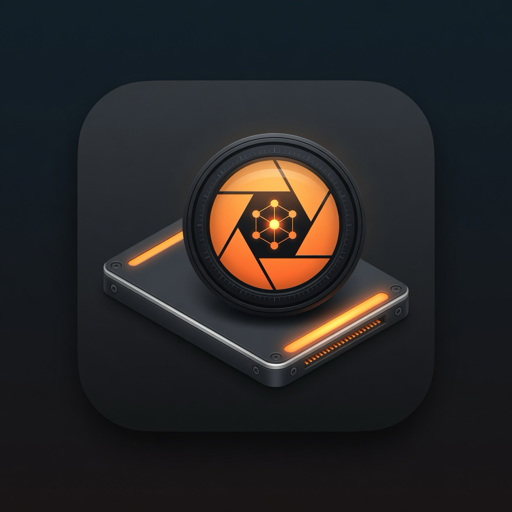

<p align="center">
  
</p>

# Local AI Studio

### Automated photoreal image generation & editing installer for Apple Silicon Macs

**One installer. External SSD. Photoreal local AI — no anime bloat, no 200-terminal-command rabbit hole.**

Local AI Studio is a **hobby installer for Apple Silicon Macs** that sets up a curated **photo generation + photo editing** stack: **ComfyUI**, **DiffusionBee**, **Ollama**, **LM Studio**, and optional **Open WebUI**. Big downloads and models go on your **external SSD**; your Mac internal drive stays around **~6–8 GB**.

Built and dogfooded on an **M4 MacBook Air 16GB** + portable SSD. Pick a tier, click install, walk away for a few hours, launch from your Desktop.


---

## What is this?

**The problem:** Getting Flux, SDXL, inpaint/relight workflows, vision LLMs, and half a dozen Mac apps to play nice together means hours of Homebrew, Python venvs, Hugging Face URLs, and “why is my Mac full?”

**What this repo does:** Packages that into a **tiered, resume-safe installer** with a GUI (live SSD progress bar), terminal fallback, and a **Desktop launcher hub** so you’re not hunting apps across your drive after install.

**What this is not:** A commercial product, a cloud service, or a guarantee that upstream links work forever. It’s glue scripts + a model catalog — see [Disclaimer](#disclaimer-read-this-for-real).

### Who it’s for

- **Apple Silicon Mac** owners with an **external SSD**
- People who want **photoreal** checkpoints and editing tools, not a 700 GB “everything” pack
- **16 GB RAM** MacBook users who can pick **STANDARD** and run one heavy model at a time
- Anyone who’d rather **re-run one installer** than manually fix twenty broken download links

### What you get after install

| Piece | Purpose |
|-------|---------|
| **ComfyUI** | Pro photoreal generation + editing (inpaint, relight, upscale) in the browser |
| **DiffusionBee** | Easiest quick realistic generations (native Mac app on SSD) |
| **26 ComfyUI models** | Flux, SDXL, RealVisXL, Juggernaut, upscalers, IP-Adapter, IC-Light, etc. |
| **8 Ollama models** | Curated vision/chat helpers — *not* the whole Ollama library |
| **LM Studio** | Extra MLX chat/vision models (download in-app) |
| **Desktop launcher** | `AI Studio Launcher.app` + shortcuts folder — one place to open everything |

> **Ollama vs ComfyUI:** Ollama’s browse list is mostly **coding/chat** LLMs (Codex, Copilot CLI, etc.). This installer does **not** pull those. Image generation lives in **ComfyUI** and **DiffusionBee**. See `LOCAL_AI_GEN/docs/WHICH_APP.txt` after install.

---

## Quick start

1. **Download** the [latest release DMG](https://github.com/PreparedToBeReckless/local-ai-installer/releases) or build from source (`./build-dmg.sh`).
2. Drag **`Install Local AI Studio (GUI).app`** to your Desktop.
3. Plug in external SSD → click **Allow SSD Access** (step 2) → pick tier → **INSTALL** (**STANDARD** ★ recommended for M4 16GB).
4. When done: open **`AI Studio Launcher.app`** on your Desktop.

Full walkthrough, flags, and troubleshooting are below.

---

## Install packages

Sizes are **measured + padded** (Ultimate full install ≈ **147 GB** on a real M4 + ExFAT SSD, July 2026).

| Tier | External SSD | Mac internal | Best for |
|------|--------------|--------------|----------|
| **STARTER** | ~55 GB | ~6 GB | Fast setup, lean catalog |
| **STANDARD** | ~110 GB | ~6 GB | **Recommended** M4 16GB |
| **PRO** | ~135 GB | ~6–8 GB | Relight, inpaint, faceswap, SD 3.5 |
| **ULTIMATE** | ~150 GB | ~6–8 GB | Full curated catalog (26 ComfyUI models) |

**Internal drive** = Homebrew, Ollama binary, Docker (if installed).  
**External SSD** = models, ComfyUI, GUI apps → `YourSSD/LOCAL_AI_GEN/`

Typical install time: **1–7 hours** depending on tier and internet.

**16 GB RAM tip:** **STANDARD** is the sweet spot on a MacBook Air. **ULTIMATE** works but run **one heavy model at a time** and close other apps during big downloads.

---

## Disclaimer (read this, for real)

This is a **fun side project**, not a funded product with a support team, SLA, or full-time maintainer watching every upstream repo.

This installer glues together a bunch of **separate tools by separate developers** (Ollama, ComfyUI, Hugging Face hosts, Homebrew, random GitHub repos, etc.). Those projects change constantly:

- Download **links can move or vanish** without anyone telling us
- Models can be **renamed, gated, or deleted**
- Apps release new versions that **break old assumptions**
- We do **not** get notified when any of that happens

So yes: an install that worked Tuesday might fail on Saturday for reasons that have nothing to do with your Mac. That's not you — it's the nature of wiring up dozens of moving parts with URLs in a shell script.

**What this means for you:**

- No warranty, no promises, no implied fitness for anything important
- Not affiliated with Ollama, ComfyUI, LM Studio, Stability, Meta, or anyone else
- Model weights and apps have **their own licenses** — you're responsible for compliant use
- If something breaks, check the log, open an issue, or fix a URL in `lib/models-catalog.sh` — PRs welcome
- For production / serious work, pin your own versions and maintain your own stack

We built this because installing all this stuff manually is tedious. It worked on our test Mac. Your mileage **will** vary. Proceed with coffee, patience, and low expectations. 🫠

---

## Credits

**[@PreparedToBeReckless](https://github.com/PreparedToBeReckless)** — project owner: concept, tier curation, model/app picks, testing, requirements, and keeping this thing pointed at photoreal / practical use on a real Mac + external SSD.

**Implementation / coding** — the installer scripts, GUI, and most of the repo were **built with AI coding assistants** (Grok via Cursor), not hand-written line-by-line by the project owner. If you're looking for a traditional solo-dev authorship story, this isn't that: it's **my project and my idea**, with the heavy implementation work done collaboratively with AI.

Upstream apps and models (Ollama, ComfyUI, LM Studio, etc.) are their own projects — we just wire them together.

---

## Install walkthrough

1. Clone this repo (or download a [release DMG](https://github.com/PreparedToBeReckless/local-ai-installer/releases)).
2. Build the DMG:
   ```bash
   ./build-dmg.sh
   open dist/Local-AI-Studio-Installer.dmg
   ```
3. **Recommended:** drag **`Install Local AI Studio (GUI).app`** to Desktop before running.  
   Running from inside the DMG works for a quick test, but ejecting the DMG later can confuse macOS if the app is still open.
4. Plug in external SSD, launch the app:
   - Click **Allow SSD Access** in step 2 (avoids Mac folder-permission popups)
   - Pick your drive (last path saved in `~/.local-ai-studio-installer.json` per user)
   - Pick tier — cards show **name + sizes**; scroll the detail panel for full model lists
   - Optional: **SD 3.5 license** + HuggingFace token (see below)
   - Click **INSTALL**
5. When done, on your Desktop:
   - **`AI Studio Launcher.app`** — one window, buttons for each app
   - **`AI Studio Apps/`** — folder with shortcuts to each GUI
   - **`Launch AI Studio.command`** — starts everything at once

**Terminal wizard** (same backend, always shows text):  
`Install Local AI Studio.app` or `Start Local AI Install.command`

---

## Fresh Mac? (one-time setup)

The installer handles almost everything:

1. **Apple Command Line Tools** — if missing, we open Apple's dialog. Click **Install** (not Get Xcode), wait ~5–10 min, run installer again.
2. **Homebrew** — installed automatically if needed (~1 GB, one password prompt).
3. **Ollama** — via Homebrew CLI (no app popup for most users).
4. **Everything else** — models, apps, ComfyUI on your SSD.

You do **not** need MacPorts, nix, or manual `pkg` installs.

---

## HuggingFace (SD 3.5 Medium only)

Only **one** ComfyUI model needs extra steps: **SD 3.5 Medium** (Stability). **CyberRealistic** is public — no license button.

1. Log into [huggingface.co](https://huggingface.co)
2. Open [stable-diffusion-3.5-medium](https://huggingface.co/stabilityai/stable-diffusion-3.5-medium) → **Agree and access repository**
3. Create a **Read** token → paste in the installer (or `huggingface-cli login`)
4. Re-run **INSTALL** — only missing files download

Token alone is **not** enough (HuggingFace returns HTTP 403 without the license click).

---

## GUI vs terminal

Both run the same script: `install-local-ai.sh`

| | GUI | Terminal wizard |
|---|-----|-----------------|
| Front end | `installer_gui.py` | `installer_wizard.sh` |
| Best for | Tier cards, live SSD counter, progress bar | Always-readable text, no Tk quirks |
| Backend | `install-local-ai.sh --tier … --ssd … --no-gui` | same |
| Close window? | **Install keeps running** in background | N/A (Terminal owns the process) |

---

## During install (GUI)

| Feature | What it does |
|---------|----------------|
| **Live SSD counter** | Green line: `SSD: 26 GB of ~150 GB target` (updates ~every 12s) |
| **Progress %** | Tied to **SSD size vs tier target**, not a frozen phase number |
| **Phase label** | e.g. `Ollama models (3/8)` or `ComfyUI image models (5…)` |
| **Elapsed time** | Running clock + typical total time for your tier |
| **Log tail** | Installer output from `/tmp/local-ai-installer-*.log` |
| **Sleep prevention** | `caffeinate` — keep Mac **plugged in** anyway |
| **SSD access** | **Allow SSD Access** + optional Full Disk Access — avoids Mac popup spam |

**You can close the installer window** — the install continues in the background. Re-open the app to watch progress:

```bash
tail -f /tmp/local-ai-installer-*.log
```

**ComfyUI re-runs:** If ComfyUI is already on your SSD, the installer skips git/pip (no repeated popups).

---

## Re-run, resume & updates

**Safe to run the installer again.** It does not wipe your SSD folder.

1. **Status scan** — compares `LOCAL_AI_GEN` vs the model catalog
2. **Sync** — downloads only what's missing; skips existing Ollama models and ComfyUI setup
3. **Resume** — interrupted install? Keep the folder, click **INSTALL** again

### CLI flags

```bash
./install-local-ai.sh --tier standard --ssd /Volumes/MySSD --no-gui

./install-local-ai.sh --audit-only --tier standard --ssd /Volumes/MySSD --no-gui
./install-local-ai.sh --refresh-hf --tier standard --ssd /Volumes/MySSD --no-gui
./install-local-ai.sh --models-only --tier ultimate --ssd /Volumes/MySSD --no-gui   # HF models only
./install-local-ai.sh --no-comfy --tier ultimate --ssd /Volumes/MySSD --no-gui      # skip ComfyUI step
./install-local-ai.sh --dry-run --tier standard --ssd /Volumes/MySSD --no-gui

./install-local-ai.sh --launchers-only --ssd /Volumes/MySSD --tier standard --no-gui
```

**Logs:** `/tmp/local-ai-installer-*.log`  
**Completion stats:** `LOCAL_AI_GEN/.install-stats.json` (measured GB + model counts)

---

## After install

| Item | Location |
|------|----------|
| AI studio root | `/Volumes/YourSSD/LOCAL_AI_GEN/` |
| **Start here (Desktop)** | `AI Studio Launcher.app`, `AI Studio Apps/`, `Launch AI Studio.command` |
| Which app for what? | `LOCAL_AI_GEN/docs/WHICH_APP.txt` |
| Photo editing guide | `LOCAL_AI_GEN/docs/PHOTO_EDITING.txt` |
| Model list | `LOCAL_AI_GEN/docs/MODELS_INSTALLED.txt` |
| Open WebUI | http://localhost:8080 (needs Docker) |
| ComfyUI | http://localhost:8188 |
| DiffusionBee | `LOCAL_AI_GEN/Applications/DiffusionBee.app` |

**Using Ollama models:** models live on your SSD (`LOCAL_AI_GEN/ollama-models/`). Use the **Desktop launcher** so `OLLAMA_MODELS` is set correctly.

**Auto cleanup:** installer DMGs on SSD are removed at the end. Optionally trash the installer `.app` and eject the DMG.

---

## Project layout

```
install-local-ai.sh      # Main engine (GUI + terminal use this)
installer_gui.py         # Visual installer (Tk)
installer_wizard.sh      # Terminal menus
lib/models-catalog.sh    # Tiered model + node catalog
lib/size-estimates.sh    # GB / time estimates (measured on real installs)
lib/audit-install.sh     # SSD vs catalog status scan
build-dmg.sh             # Build Local-AI-Studio-Installer.dmg
studio_launcher.py       # Post-install app picker (bundled to SSD)
app/                     # Terminal .app bundle
app-gui/                 # GUI .app bundle
```

---

## Requirements

- Mac with **Apple Silicon** (arm64)
- **External SSD** with enough free space (see tier table + ~25 GB headroom)
- **~6–8 GB free** on Mac internal (Homebrew, Ollama, optional Docker)
- Internet for downloads
- **ExFAT SSD** works — ComfyUI Python env on **internal Mac**; models on SSD

---

## Troubleshooting

| Issue | Fix |
|-------|-----|
| Mac folder-permission popups | **Allow SSD Access** before INSTALL; **Stop Popups** → Full Disk Access |
| ComfyUI step keeps re-running | Update to latest build — skips when already set up |
| SD 3.5 won't download | Accept license on HuggingFace + paste Read token |
| GUI text blank / grey | Drag app to Desktop; use terminal wizard |
| Progress stuck at one % | Bar tracks SSD GB vs tier target — wait for counter to update |
| Exit 143 mid-install | Re-run INSTALL — models on SSD are kept |
| Ollama empty | Use Desktop launcher, or set `OLLAMA_MODELS` to SSD path |
| HF model failed | Gated or offline — see `docs/HUGGINGFACE.txt` |

**Verify a healthy run:**

```bash
tail -40 "$(ls -t /tmp/local-ai-installer-*.log | head -1)"
du -sh /Volumes/YourSSD/LOCAL_AI_GEN
cat /Volumes/YourSSD/LOCAL_AI_GEN/.install-stats.json
```

---

## Build from source

```bash
git clone https://github.com/PreparedToBeReckless/local-ai-installer.git
cd local-ai-installer
./build-dmg.sh
open dist/Local-AI-Studio-Installer.dmg
```

No code signing — fine for personal use and GitHub hobby releases.

---

## License

MIT — installer scripts only. See [LICENSE](LICENSE).

Third-party models, apps, and weights have their own terms — check each provider (Hugging Face, Ollama, etc.).

---

## Contributing

PRs welcome — especially **catalog URL fixes** when upstream breaks something. Keep tiers honest about GB and RAM.